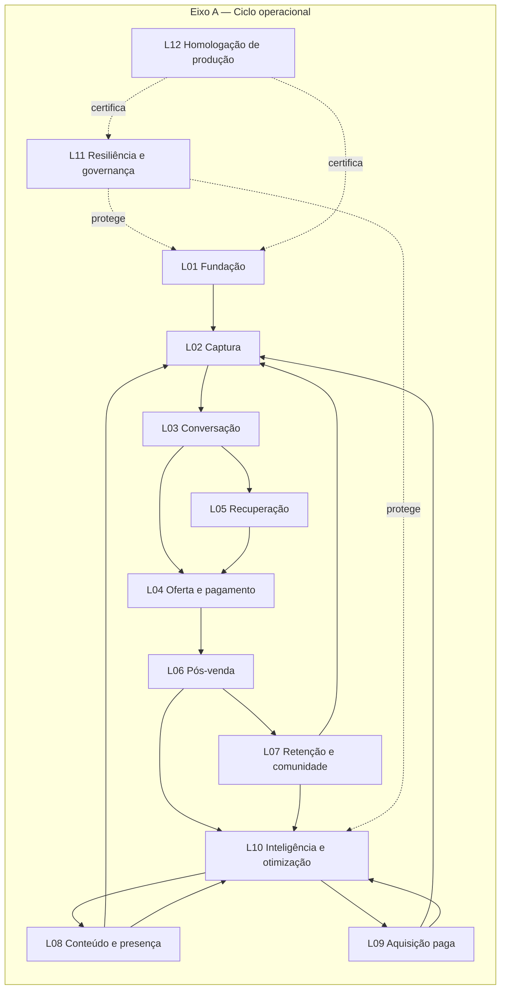
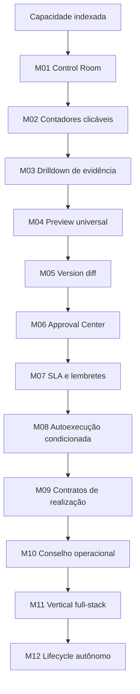
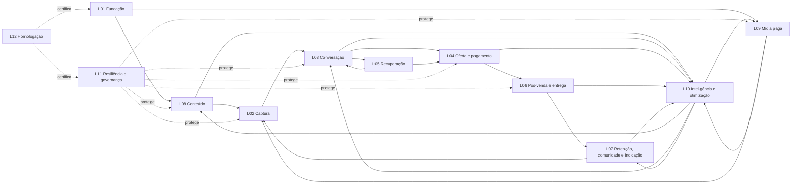
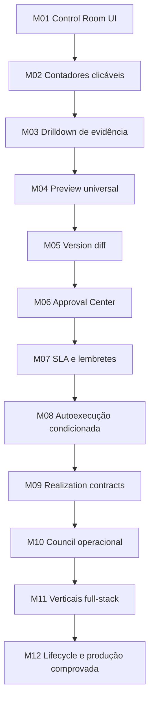

# NexOS Capability Index

**Meta — homologação de 08/10/2026:** credenciais existentes copiadas somente
para o perfil privado e runtime reiniciado. API pública confirma OAuth habilitado,
gera retorno Instagram e valida/rejeita assinatura de webhook com evento vazio.
[Evidência](docs/META_HOMOLOGATION_CONFIGURATION.json). Nenhuma conexão/publicação
real; maturidade inalterada. Próximo checkpoint: cadastrar retorno no painel Meta,
autorizar a conta e verificar recebimento real do comentário MAPA.

**Asaas sandbox — 07/10/2026:** chave de homologação autenticada com HTTP 200,
perfil privado configurado em sandbox e runtime reiniciado. Produção permanece
separada; nenhuma criação de cliente/cobrança/webhook nesta validação.
[Evidência](docs/ASAAS_SANDBOX_AUTHENTICATION.json). Maturidade inalterada;
próximo checkpoint: jornada sandbox de checkout, liquidação e webhook público.

**APIs de IA — homologação de 07/10/2026:** autenticação/listagem de modelos
OpenAI e Gemini passou; chaves nativas guardadas somente no perfil privado e
runtime reiniciado. Anthropic exige ID de workspace, ainda não informado.
[Evidência sem segredos](docs/AI_PROVIDER_HOMOLOGATION_RESULTS.json).
Nenhuma geração/inferência real certificada; maturidade inalterada. Próximo
checkpoint: resolver escopo Anthropic e validar a jornada de IA na homologação.

**Login de homologação — 07/10/2026:** Sonner montado e erro persistente no
formulário; launcher autoriza os dois endereços loopback da interface.
TypeScript/UI negativa e bloqueio de origem externa verificados; API reiniciada
e pronta. [Evidência](docs/LOGIN_HOMOLOGATION_VALIDATION.md). Maturidade inalterada;
`https://agencianexos.vip` configurado: prontidão/login/administração por UUID
passaram pelo domínio público; sessão de verificação encerrada. Próximo checkpoint:
retornos/permissões Meta e recebimento real do comentário MAPA.

**Comentário MAPA — 07/10/2026:** corrigida leitura de `id/text/media.id` no
webhook Instagram. Testes Linux/Docker passaram para resposta imediata configurada,
envio público/privado simulado e repetição/conta desconhecida. Supabase preservado.
[Evidência e limites](docs/MAPA_COMMENT_VALIDATION.md). Maturidade inalterada;
próximo checkpoint: recebimento real em conta Meta autorizada na homologação.

**CI P3 — correção de 07/10/2026:** reproduzida em Linux a ausência de TypeScript
no runner; workflow instala dependências antes do P3. Diagnóstico passa a incluir
stdout/stderr com segredos de fixtures ocultos. Três testes do runner passaram em
Linux; execução remota do novo commit permanece pendente. Supabase não foi acessado.
[Evidência e limite](docs/CI_REGRESSION_FIXES.md). Maturidade inalterada.

**Dados padrão Supabase — 07/10/2026:** esquema e privilégios verificados;
planos Solo/Agency carregados, founder preservado e duas pastas padrão criadas
no seu workspace. Nenhuma fixture ou memória compartilhada entre projetos foi
inserida. [Carga verificada](docs/SUPABASE_HOMOLOGATION_DEFAULT_DATA.json).
Próximo checkpoint: jornada de navegador e provedores sandbox na homologação.
Maturidade inalterada; desenvolvimento/regressões permanecem locais/Docker.

**Separação de ambientes — 07/10/2026:** Supabase reservado à homologação;
desenvolvimento no PostgreSQL local/Docker e regressões em bancos descartáveis
locais/Docker. Removido `homologation:test`; o runtime de testes bloqueia conexões
Supabase. Perfil de homologação separado, dados e evidências históricos preservados.
Próximo checkpoint: jornada de navegador e provedores sandbox na homologação.
[Política e comandos](docs/SUPABASE_HOMOLOGATION.md). Maturidade inalterada.

**Supabase — homologação de 06/10/2026:** esquema externo preparado (177 tabelas,
75 entradas de esquema/migração e 19 triggers ativos), TLS verificado, role privada
e acesso público bloqueado. Seis grupos de regressão, administração founder por
UUID e API compilada com Redis exclusivo passaram. Perfis, portas e filas locais
permanecem separados. Próximo checkpoint: jornada de navegador e provedores
sandbox autorizados. [Guia/evidência](docs/SUPABASE_HOMOLOGATION.md).
Maturidade permanece inalterada; implantação pública não foi feita.

## Fluxo operacional único e plano canônico de indexação de capacidades

> Este documento unifica o fluxo operacional dos screenshots, o Realization Engine, o Control Room e a fila de 12 passos de implementação.
>
> O `NEXOS_WORKFLOW_MAP.md` continua sendo o contrato de arquitetura, governança e Definition of Done. Este arquivo é o índice operacional: ele registra **o que o NexOS faz**, **em qual estágio**, **com qual nível de maturidade**, **quais dependências existem** e **qual evidência prova a capacidade**.
>
> O progresso comprovado e o próximo checkpoint são mantidos em [`NEXOS_BUILD_CHECKLIST.md`](./NEXOS_BUILD_CHECKLIST.md).

---

## 1. Como ler o sistema único

**Ativação real P0 — checkpoint de 06/10/2026:** por autorização explícita,
`founder@nexos.ai` foi criado como primeiro usuário master local. UUID Academy,
login, sessão, revogação e auditoria passaram por HTTP; segredo legado desativado.
A credencial disponível retornou 401 no Asaas sandbox; o token local foi preparado, mas faltam chave válida
e URL pública da aplicação para o webhook. Não houve cobrança ou implantação
externa. M10/M11/M12 permanecem no estado anterior.
[Evidência e requisitos](./docs/P0_REAL_ACTIVATION_STATUS.md).

**Isolamento de projetos e usuários (06/10/2026):** ownership atual verificado
por requisição; memória e contexto vinculados a workspace/projeto; referências
entre projetos removidas; configurações concorrentes de agentes isoladas;
histórico privado do navegador separado e limpo na troca de conta/workspace.
Migração 0069, testes negativos e 23 grupos locais passaram em imagem reconstruída.
[Evidência e limites](./docs/PROJECT_CONTEXT_ISOLATION.md). CI remoto, aplicação
da migração em homologação e auditoria dos artefatos antigos permanecem pendentes.
M10 continua concluído; M11/M12 permanecem incompletos.

Reparo de CI de 06/10/2026: saúde operacional pura executa sem infraestrutura;
o job de banco gera uma chave de teste válida de 32 bytes. Testes locais passaram,
incluindo retomada de conteúdo em PostgreSQL descartável; reexecução remota segue
pendente. [Evidência](./docs/CI_REGRESSION_FIXES.md).

Checkpoint P3 de 06/10/2026: jornada conectada e entrega Academy em provedores
simulados, concessões de objeto por lease, regressões de mídia/execução e
integridade de banco passaram localmente. Dataset/regras de IA cobrem cinco
artefatos; referências sintéticas não certificam modelos. Evidência e roteiro
externo em [P3_CLOSEOUT](./docs/P3_CLOSEOUT.md). Homologação real, vídeo GPU e
launch Google/TikTok seguem abertos; M11/M12 e certificação GLP22 não são promovidos.

Implantação anterior ao P3: aplicação Docker com PostgreSQL local opcional ou
externo com TLS verificado validada em fixtures isoladas, incluindo restauração
da disponibilidade após queda do banco. Evidência no
[guia Docker](./docs/DOCKER_DEPLOYMENT.md) e checklist. Ativação real permanece
pendente e os níveis de maturidade/certificação das capacidades não mudam.

Checkpoint transversal de 06/10/2026: P1 e P2 foram preparados e validados
localmente, incluindo autorização de conteúdo pago, CI crítico, Redis persistente,
backup/restauração e recuperação sob falhas/carga. Evidência e limites em
[P1](./docs/P1_CLOSEOUT.md), [P2](./docs/P2_CLOSEOUT.md) e no checklist canônico.
Essa prova de infraestrutura não altera os níveis M11/M12 nem certifica
capacidades GLP22; o P3 local abaixo não substitui a ativação e a homologação reais.

O NexOS possui duas dimensões complementares:

1. **12 estágios do ciclo operacional** — descrevem a jornada completa executada pelo NexOS, da fundação à homologação.
2. **12 níveis de maturidade da capacidade** — descrevem quanto de cada capacidade está realmente implementado, observável, autorizável e comprovado.

Os estágios não substituem os níveis e os níveis não são novas etapas comerciais. Cada capacidade de cada estágio deve avançar pelos mesmos níveis de maturidade.





---

## 2. Fluxo operacional completo

### L01 — Fundamentos de execução

**Objetivo:** garantir que toda ação esteja vinculada ao workspace correto, ao Master Plan aprovado e a uma autorização válida.

**Capacidades:**

- Master Plan imutável e versionado;
- isolamento por workspace e campanha;
- idempotência;
- leases e fencing;
- registro de intenção, tentativa, recibo e verificação;
- falha fechada quando o resultado externo é ambíguo;
- ações externas permitidas somente dentro do envelope aprovado;
- recuperação e compensação;
- rastreabilidade do agente, worker, usuário, versão e contexto;
- estado operacional separado de promessas comerciais;
- migrations determinísticas e reversíveis;
- schedulers com ownership único.

**Saída necessária:** contexto aprovado, identidade operacional, autorização vinculada e infraestrutura apta a executar sem misturar clientes.

**Bloqueia:** todos os demais estágios quando ownership, autorização, evidência ou infraestrutura não são confiáveis.

---

### L02 — Captura e primeiro contato

**Objetivo:** transformar um lead capturado em primeiro contato real, individual e enviado uma única vez.

**Capacidades:**

- captura por formulário, landing page, anúncio, webhook e importação autorizada;
- deduplicação por e-mail, telefone e identidade externa;
- primeiro contato aprovado por item, campanha e canal;
- envio por e-mail e WhatsApp autorizado;
- classificação inicial;
- tag de origem, campanha, produto, item e workspace;
- distribuição regional e por capacidade;
- persistência de mensagem, tentativa, entrega, resposta e falha;
- bloqueio de contato duplicado;
- isolamento de contatos entre workspaces;
- consentimento, opt-out e listas de supressão;
- exatamente uma primeira abordagem por contato e item.

**Saída necessária:** lead identificado, origem comprovada, primeiro contato registrado e próximo estágio definido.

---

### L03 — Conversação comercial

**Objetivo:** conduzir conversas de venda depois que o lead responde, sem saltar classificação ou etapa.

**Capacidades:**

- receber respostas de WhatsApp e e-mail;
- associar cada resposta ao contato, campanha, item e conversa corretos;
- identificar intenção, temperatura e estágio;
- registrar histórico completo e contexto resumido;
- responder perguntas sobre produto, preço, condições e entrega;
- detectar pedido de descadastro;
- tratar objeções;
- agendar follow-up quando necessário;
- impedir mensagens fora de contexto;
- respeitar opt-out, silêncio, pausa, frequência e limites;
- transferir para humano quando necessário;
- agentes especializados por aquecimento, desejo, objeção, fechamento e consultoria;
- progressão máxima de um estágio comercial por evidência.

**Saída necessária:** próximo passo comercial explícito — nutrir, responder, apresentar oferta, aguardar, transferir, pausar ou encerrar.

---

### L04 — Oferta, checkout e pagamento

**Objetivo:** conduzir o lead qualificado até uma compra real e confirmada.

**Capacidades:**

- selecionar oferta aprovada;
- confirmar preço, moeda, parcelamento e bônus;
- gerar checkout com identificador idempotente;
- vincular checkout a contato, campanha, versão da oferta e workspace;
- validar capacidade, estoque, vagas e elegibilidade;
- processar webhooks de pagamento;
- diferenciar criado, pendente, pago, recusado, expirado, estornado e reembolsado;
- impedir cumprimento antes da confirmação;
- impedir dupla cobrança;
- tratar parcelamento e recorrência;
- conciliar checkout, webhook, recebível e pedido;
- suportar Asaas e demais adapters somente quando homologados;
- armazenar receipts sem expor segredos.

**Saída necessária:** pagamento confirmado e conciliado, ou estado terminal/retryable claramente registrado.

---

### L05 — Recuperação de vendas

**Objetivo:** recuperar leads e checkouts parados sem spam e sem mensagens duplicadas.

**Capacidades:**

- follow-up após ausência de resposta;
- recuperação de checkout abandonado;
- cadências por temperatura, estágio e comportamento;
- limites por canal e período;
- horários, timezone e quiet hours;
- pausa automática após resposta;
- encerramento após compra, descadastro, limite ou timeout;
- mensagens baseadas no Master Plan e histórico real;
- recuperação de falhas transitórias de provedor;
- deduplicação de jobs;
- retomada segura sem envio cego;
- atribuição de receita recuperada.

**Saída necessária:** conversa retomada, compra confirmada, transferência, pausa ou encerramento comprovado.

---

### L06 — Pós-venda e entrega

**Objetivo:** transformar pagamento confirmado em entrega real.

**Capacidades:**

- criar pedido, matrícula ou contrato apenas após pagamento;
- liberar produto, curso, serviço, arquivo ou acesso correto;
- onboarding do cliente;
- confirmação de pedido e entrega;
- acompanhamento de implantação;
- suporte e rastreabilidade;
- organização de ativos, gravações e entregáveis;
- validação de entitlement;
- compensação em falhas parciais;
- evidência de que a entrega ocorreu;
- garantia de que aprovação ou pagamento não sejam confundidos com entrega;
- atualização de CRM e lifecycle.

**Saída necessária:** entitlement ativo e entrega confirmada, ou exceção operacional visível e recuperável.

---

### L07 — Retenção, comunidade e indicação

**Objetivo:** continuar o relacionamento depois da compra.

**Capacidades:**

- segmentação por produto, etapa e temperatura;
- comunidades autorizadas por canal;
- provisionamento e elegibilidade;
- conteúdo de onboarding e ativação;
- nurturing pós-venda;
- solicitação de avaliação;
- pesquisa de satisfação;
- prevenção de churn;
- win-back e reativação;
- upsell, cross-sell e recompra;
- referral e indicação;
- rastreamento de recompensa e atribuição;
- controle de consentimento;
- saída automática após cancelamento, descadastro ou perda de elegibilidade;
- proibição de adicionar pessoas automaticamente em grupos sem autorização.

**Saída necessária:** cliente ativado, retido, reativado, expandido, indicado ou encerrado com histórico completo.

---

### L08 — Conteúdo e presença digital

**Objetivo:** operar a presença orgânica do cliente de forma contínua.

**Capacidades:**

- planejamento semanal;
- posts, carrosséis, reels e stories;
- conteúdo baseado em mercado, estratégia, psicologia, produto e contexto;
- aprovação quando exigida;
- publicação programada;
- previews por plataforma;
- versionamento e diff;
- calendário editorial;
- métricas orgânicas;
- comentários, respostas, DMs e moderação;
- regras de marca e compliance;
- clone digital consentido;
- rastreamento de contexto, versão e workspace;
- reutilização multiformato sem perder a mensagem central;
- isolamento completo entre clientes.

**Saída necessária:** conteúdo aprovado, publicado, confirmado pelo provedor e monitorado.

---

### L09 — Aquisição paga

**Objetivo:** criar, lançar e otimizar campanhas pagas reais.

**Capacidades:**

- plano de mídia aprovado;
- seleção de canal, pixel, conta e página;
- públicos, criativos, copy, orçamento e calendário;
- vínculo obrigatório entre anúncio, campanha, Master Plan e workspace;
- preview antes de ativação;
- mutações determinísticas via adapters;
- recibo e readback do provedor;
- compliance e políticas de plataforma;
- limites de orçamento;
- autorização para alterações interplataforma;
- métricas confirmadas por API;
- atribuição e reconciliação;
- otimização intraplataforma dentro do envelope;
- bloqueio para credencial, permissão ou capability indisponível.

**Saída necessária:** campanha confirmada pelo provedor, orçamento governado e resultados reconciliados.

---

### L10 — Inteligência e otimização autônoma

**Objetivo:** fazer o NexOS aprender com os resultados reais e melhorar continuamente.

**Capacidades:**

- coleta de métricas de conteúdo, leads, vendas e mídia;
- comparação com o Master Plan;
- Council operacional;
- avaliação de hipóteses;
- detecção de gargalos e desvios;
- recomendação e execução dentro das permissões;
- retenção de memória entre campanhas sem misturar clientes;
- experimentos com hipótese, versão e critério de parada;
- análise de cohort, LTV, CAC, CPL, conversão, retenção e margem;
- decisões append-only;
- vínculo entre decisão, ação e resultado;
- prevenção de mudanças simultâneas não atribuíveis;
- relatórios e exports;
- feedback para estratégia, conteúdo, vendas, lifecycle e mídia.

**Saída necessária:** decisão baseada em evidência, ação autorizada e verificação no ciclo seguinte.

---

### L11 — Resiliência, governança e recuperação

**Objetivo:** impedir que falhas silenciosas deixem o sistema declarar sucesso sem comprovação.

**Capacidades:**

- monitoramento de filas e schedulers;
- diagnóstico de posts, pagamentos, entregas e jobs travados;
- dead-letter e retries limitados;
- pausas operacionais;
- leases e fencing;
- auditoria completa;
- redaction e sanitização;
- checkpoints;
- recuperação sem repetir mutações externas;
- compensações;
- bloqueio para revogação de credencial;
- cache de sucesso protegido contra falhas transitórias;
- health checks de provider;
- exceções visíveis no Control Room;
- provas de ausência de duplicação.

**Saída necessária:** sistema recuperado, compensado ou pausado com responsabilidade explícita.

---

### L12 — Homologação de produção

**Objetivo:** provar que os fluxos funcionam com serviços reais antes de declarar a capacidade pronta.

**Roteiro mínimo:**

1. criar conta/campanha real de teste controlado;
2. aprovar Master Plan;
3. capturar um lead;
4. enviar o primeiro contato;
5. receber e processar resposta;
6. gerar oferta e checkout;
7. confirmar pagamento sandbox ou controlado;
8. executar entrega;
9. publicar conteúdo;
10. capturar métricas;
11. simular falha e provar recuperação;
12. confirmar separação de workspace;
13. guardar receipts, readbacks, screenshots e logs sanitizados;
14. registrar quem autorizou, quando, em qual versão e sob qual orçamento.

**Regras:**

- nenhum teste modelado substitui prova real quando a capacidade depende de provedor;
- sandbox prova integração, não prova automaticamente produção;
- publicação, cobrança e gasto real exigem autorização explícita;
- qualquer resultado ambíguo impede certificação;
- uma capability só recebe estado `production_proven` com pacote de evidência verificável.

**Saída necessária:** certificado interno versionado de capability, ambiente, adapter, escopo, limitações e evidências.

---

## 3. Relações e loops do fluxo

O fluxo não termina após uma compra. Ele é uma máquina cíclica com caminhos controlados:



---

## 4. Os 12 níveis de maturidade aplicados às capacidades

Os 12 passos anteriormente definidos tornam-se o eixo de maturidade do Capability Index.

### M01 — Visibilidade no Control Room

A capability apresenta estado real, ownership, dependências e empty state honesto.

### M02 — Contadores clicáveis

Contadores persistidos para aprovações, entregáveis, bloqueios, falhas, confirmações e exceções levam aos registros exatos.

### M03 — Drilldown de evidência

Timeline de agentes, versões, tentativas, receipts, readbacks, resultados, falhas e recuperação.

### M04 — Preview universal

Concluído para sete fontes persistidas com contrato read-only, ownership, paginação determinística, filtros, sanitização, estados honestos e representações de texto, imagem, vídeo, página, mensagem, anúncio e dados estruturados. Formulários e checkout aguardam fonte persistida dedicada.

### M05 — Version diff

Concluído em modo read-only para snapshots imutáveis do Master Plan e revisões persistidas de páginas. Possui catálogo honesto, base/alvo explícitos, ownership, diff determinístico por JSON Pointer, sanitização sem falso idêntico, limites globais com avisos e homologação desktop/mobile. Fontes mutáveis sem histórico permanecem declaradas como `history_not_persisted`.

### M06 — Approval Center

Concluído para Master Plan, conteúdo e checkpoints. Cada decisão é append-only e vinculada ao workspace, campanha, ator, subject, versão/snapshot e contexto exatos, com motivo obrigatório para rejeição ou revisão, proteção stale/race/idempotente, invariantes compostos no banco e conclusão transacional dos checkpoints. Page, social, creative e video permanecem declarados como `adapter_not_governed`.

### M07 — SLA e lembretes

Concluído para os subjects governados pelo M06. Cada obrigação é vinculada ao snapshot exato e possui `dueAt`, aviso in-app uma hora antes, escalonamento, expiração fail-closed, eventos/receipts append-only, auditoria, processamento concorrente idempotente e histórico responsivo. Expiração nunca aprova e nenhuma entrega M07 executa efeitos externos.

### M08 — Autoexecução condicionada

Concluído para `paid_media_pause`. A política é versionada, desativada por padrão, owner-authorized, temporária e vinculada ao Master Plan aprovado exato. Preflight e teto são fail-closed; intent/attempt são duráveis e idempotentes; locks PostgreSQL serializam policy, revogação e execução; sucesso exige receipt e readback independente correspondente. Aprovação isolada nunca executa.

### M09 — Contratos de realização

Concluído para `paid_media_pause` e `paid_media_launch`: proposal, binding imutável, preflight fail-closed, attempt durável, receipt+readback independente, QC, monitoramento, retry limitado, recovery e compensation verificável. Outras famílias permanecem explicitamente não governadas.

### M10 — Council operacional

Concluído no escopo de contratos M09 governados: ciclos e atas com evidências persistidas, decisões com responsável, meta/baseline/limiar/janela/prazo, ligação de ações à versão aprovada exata do Master Plan e outcomes append-only. A verificação exige ciclo posterior da mesma vinculação com ata citando o contrato, além de receipt, readback, QC aprovado e monitoramento do último attempt confirmado; inconclusões podem ser reverificadas quando a evidência muda. Council não aprova, não executa e não transforma famílias não suportadas em executáveis. Não há homologação de resultado comercial externo nesta etapa.

### M11 — Vertical full-stack

UI, API, banco, agente, worker, fila, provider, preview, aprovação, evidência, métricas, recuperação, testes e relatórios funcionam juntos.

**Estado: em andamento, não concluído.** A primeira vertical Content/Social já integra inbox e relatórios históricos, preview/confirm com fingerprint, posts duráveis deduplicados e teste local de publicação Facebook com receipt, readback e evidência usando Graph simulado. O gatilho legado de autopublicação após aprovação/finalização de mídia e a rota legada de campanha sem prévia foram bloqueados; novos agendamentos não autorizados recebem falha explícita, e os antigos são preservados porém bloqueados antes de envio ao vencerem. Ainda faltam binding imutável da peça no instante da aprovação, política versionada para autopublicação por ausência de resposta, reconciliação segura dos bloqueados, validação do fluxo autenticado/recuperação/métricas e homologação de permissões e readback com Meta real. A simulação não constitui prova de envio externo.

### M12 — Lifecycle autônomo e produção comprovada

A capability atua no ciclo completo, respeita governança, reage a eventos, otimiza e possui homologação real.

**Estado: em andamento apenas nos fundamentos locais; não concluído.** Contatos/eventos e intenções de recuperação, onboarding, retenção, upsell e indicação já têm registros locais; painel read-only, reconciliação negativa sem envio e reparo atômico de efeitos de venda/reembolso tornam o estado observável e recuperável. Uma intenção pendente não é entrega, ativação ou conversão. Ativação manual sem evidência foi bloqueada. Faltam governança completa de M11, autorização versionada de lifecycle, entrega e readback reais, métricas atribuídas, decisão de otimização com resultado posterior e homologação controlada em produção. M10 continua o último nível concluído.

---

## 5. Estados canônicos de uma capability

Uma capability usa somente estes estados:

| Estado | Significado |
|---|---|
| `indexed` | identificada e registrada, sem promessa de execução |
| `specified` | contrato, ownership, dependências e gates definidos |
| `implemented` | código funcional existe |
| `integrated` | UI, API, dados, workers e adapters estão conectados |
| `verified_local` | testes locais/fixtures reais passaram |
| `sandbox_proven` | provider sandbox confirmou mutação/readback |
| `production_ready` | preflight, limites, recovery e runbook prontos |
| `production_proven` | execução real controlada possui receipts e evidência |
| `monitored` | métricas, alertas e reconciliação operam continuamente |
| `optimized` | Council fechou ciclos decisão → ação → resultado |
| `blocked` | dependência, autorização, contrato ou provider impede avanço |
| `deprecated` | retirada explícita com substituição e migração registradas |

Regras:

- `implemented` não significa `production_proven`;
- `production_ready` não autoriza publicação, cobrança ou gasto real;
- `blocked` deve indicar causa, owner e condição de desbloqueio;
- uma capability não pode avançar sem pacote de evidência do estado anterior;
- estados são calculados a partir de evidências, não escolhidos para fins comerciais.

---

## 6. Registro obrigatório de cada capability

Cada capability deve possuir um registro com:

```yaml
capabilityId: NX-<stage>-<domain>-<sequence>
name: nome humano
stage: L01..L12
domain: foundation|capture|sales|checkout|recovery|delivery|lifecycle|content|ads|intelligence|governance|homologation
status: indexed|specified|implemented|integrated|verified_local|sandbox_proven|production_ready|production_proven|monitored|optimized|blocked|deprecated
maturityLevel: M01..M12
workspaceScoped: true
campaignScoped: true|false
masterPlanBound: true|false
dependencies: []
authorization:
  type: none|material_approval|budget_approval|provider_scope|external_mutation
  versionBound: true|false
interfaces:
  uiRoutes: []
  apiRoutes: []
execution:
  agents: []
  workers: []
  queues: []
  schedulers: []
providers:
  required: []
  capabilities: []
  credentialGate: unknown|ready|blocked
contracts:
  input: reference
  output: reference
  preview: reference
  receipt: reference
evidence:
  sourceTables: []
  timelineTypes: []
  latestProofId: null
  proofEnvironment: local|sandbox|production|null
metrics:
  source: []
  reconciliation: []
recovery:
  retries: bounded
  compensation: reference
  deadLetter: reference
tests:
  unit: []
  integration: []
  concurrency: []
  ownership: []
  provider: []
limitations: []
owner: subsystem or team
lastVerifiedAt: null
```

Valores de segredo, tokens, URLs assinadas e dados pessoais nunca entram no índice.

---

## 7. Hierarquia de IDs

### Estágios

- `NX-L01-*` — Fundamentos;
- `NX-L02-*` — Captura;
- `NX-L03-*` — Conversação;
- `NX-L04-*` — Oferta e pagamento;
- `NX-L05-*` — Recuperação;
- `NX-L06-*` — Pós-venda;
- `NX-L07-*` — Retenção e comunidade;
- `NX-L08-*` — Conteúdo;
- `NX-L09-*` — Aquisição paga;
- `NX-L10-*` — Inteligência;
- `NX-L11-*` — Governança;
- `NX-L12-*` — Homologação.

### Exemplos

- `NX-L02-CAPTURE-001` — captura de lead por formulário;
- `NX-L02-FIRSTTOUCH-001` — primeiro contato exatamente uma vez;
- `NX-L03-WHATSAPP-001` — resposta contextual no WhatsApp;
- `NX-L04-ASAAS-001` — checkout e confirmação Asaas;
- `NX-L05-ABANDONED-001` — recuperação de checkout abandonado;
- `NX-L06-FULFILLMENT-001` — entrega após pagamento confirmado;
- `NX-L07-COMMUNITY-001` — provisionamento autorizado de comunidade;
- `NX-L08-SOCIAL-001` — publicação social confirmada;
- `NX-L09-METAADS-001` — campanha Meta Ads;
- `NX-L10-COUNCIL-001` — Council baseado em evidências;
- `NX-L11-RECOVERY-001` — recuperação de execução ambígua;
- `NX-L12-CERT-001` — certificação interna de produção.

---

## 8. Como o Control Room usa o índice

O Control Room é a interface operacional do Capability Index.

Ele deve exibir:

- estágio atual da campanha e do cliente;
- capabilities relevantes para o contexto;
- estado e nível de maturidade;
- dependências e bloqueios;
- aprovações pendentes;
- credenciais e adapters;
- agentes e workers ativos;
- entregáveis e previews;
- evidence timeline;
- receipts e readbacks;
- métricas reconciliadas;
- recovery e exceções;
- última homologação;
- limitações conhecidas.

Todo contador deve ser clicável e abrir exatamente os registros usados para calculá-lo.

Capacidades `indexed`, `specified` ou `blocked` não devem aparecer como funcionalidades disponíveis ao cliente. Elas podem aparecer somente em superfícies internas de planejamento e governança.

---

## 9. Ordem lógica de implementação

A ordem de implementação não percorre um estágio inteiro isoladamente. Ela constrói a infraestrutura transversal e depois fecha verticais completas.



### Posição atual

- **M01 concluído:** Control Room UI consome API real e possui estados vazios honestos.
- **M02 concluído:** contadores acionáveis abrem a composição persistida de entregáveis, integrações, checkpoints e estados canônicos de evidência.
- **M03 concluído:** timeline paginada e filtrável com ownership, ordenação determinística, registros exatos, sanitização e links de origem verificados.
- **M04 concluído:** previews paginados e filtráveis para sete fontes persistidas, com renderização segura, fallback estruturado e homologação desktop/mobile.
- **M05 concluído:** comparação read-only de versões do Master Plan e revisões de página, com catálogo de comparabilidade, ownership, sanitização, limites determinísticos e homologação desktop/mobile.
- **M06 concluído:** Approval Center com decisão imutável e motivada, binding exato de snapshot/contexto, ownership composto, stale/race/idempotência, limites de resposta e homologação desktop/mobile sem efeitos externos.
- **M07 concluído:** SLA governado por snapshot com aviso in-app de uma hora, due/escalation/expiration, receipts e auditoria append-only, locks concorrentes, contadores exatos e homologação desktop/mobile sem efeitos externos.
- **M08 concluído:** pausa de mídia paga condicionada por política versionada e vigente, binding exato, gates fail-closed, intent/attempt idempotentes, serialização cross-process e confirmação somente após receipt+readback; UI homologada em desktop/mobile sem rede externa.
- **M09 e M10 concluídos; M11 e fundamentos M12 em andamento:** primeira vertical Content/Social ainda sem prova externa completa; o lifecycle M12 é observável e reconciliável localmente, não uma operação autônoma homologada.
- Os fundamentos já implementados são registrados como capabilities individuais, mas não promovem automaticamente todo um estágio para produção.
- O status histórico apresentado nos screenshots deve ser importado como alegação a auditar, não como prova canônica. Cada conclusão precisa ser recalculada a partir do código, banco, testes, receipts e homologações atuais.

### Ordem das verticais no M11

1. Content/Social;
2. Website/Funnels;
3. vídeo/creative;
4. e-mail/Community;
5. CRM/Sales;
6. Checkout/Fulfillment;
7. Ads;
8. SEO;
9. Lifecycle;
10. Analytics e Council.

---

## 10. Gate de conclusão por estágio

Um estágio só pode ser declarado completo quando todas as capabilities críticas:

- estão indexadas;
- têm ownership e escopo de workspace;
- possuem contrato de entrada e saída;
- estão ligadas ao Master Plan quando aplicável;
- têm preflight e autorização;
- executam trabalho real;
- possuem preview e diff quando aplicável;
- registram receipts/readbacks;
- possuem timeline de evidência;
- reconciliam métricas;
- recuperam falhas sem duplicar ações;
- passaram testes de ownership e concorrência;
- foram homologadas no ambiente necessário;
- aparecem no Control Room com drilldowns;
- têm limitações e dependências explícitas.

Uma capability isolada pronta não torna o estágio inteiro pronto.

---

## 11. Comandos de controle do programa

Estes comandos representam regras de execução do roadmap, não comandos de produto:

### Continuar do ponto exato

Continuar somente do último checkpoint comprovado. Não repetir etapas concluídas e não avançar sem critérios.

### Pausar

Parar após concluir e validar a unidade atual. Não iniciar a próxima etapa.

### Auditar antes de continuar

Realizar revisão independente das mudanças atuais e corrigir problemas críticos e altos.

### Exigir teste real

Não aceitar testes modelados como prova suficiente. Usar fixtures reais de banco, concorrência e provedores simulados; usar sandbox ou produção controlada quando o adapter exigir.

### Impedir ações externas

Trabalhar somente com banco local, sandbox e providers simulados, salvo autorização explícita.

### Permitir homologação controlada

Executar homologação externa descrita, parando antes de cobrança, publicação ou gasto não explicitamente aprovado.

### Exigir limite de interface

Continuar somente no backend e infraestrutura quando nenhuma mudança de interface tiver sido autorizada.

### Resumo de checkpoint

Ao final de cada unidade, registrar: entregue, provas, riscos restantes, capability IDs afetados, estados anteriores/novos e próximo comando.

---

## 12. Regra final

O NexOS não será medido por número de páginas, agentes ou integrações declaradas. Será medido por capabilities indexadas e comprovadas.

Uma capability só conta quando:

1. executa trabalho real;
2. respeita ownership e autorização;
3. produz evidência;
4. permite inspeção;
5. recupera falhas;
6. reconcilia resultado;
7. possui status honesto;
8. não depende de afirmações sem prova.

O fluxo operacional e o índice de maturidade formam um único contrato. Nenhum roadmap paralelo deve ser criado fora dele.
