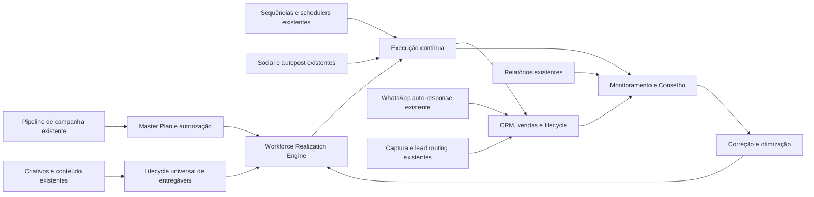
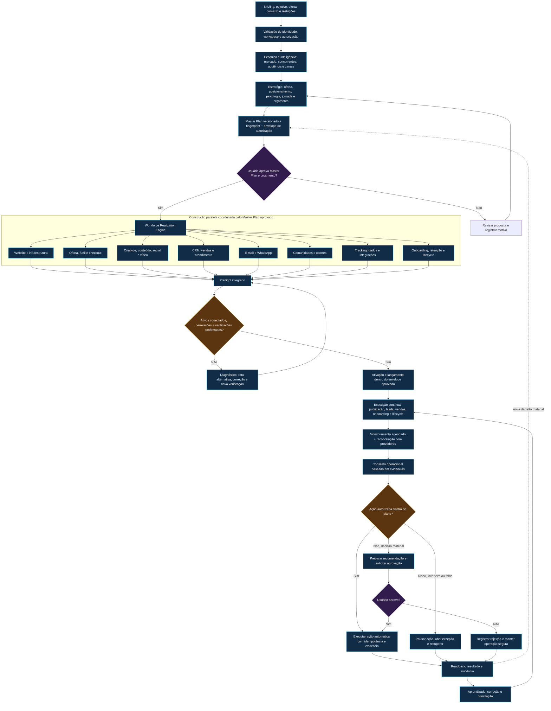
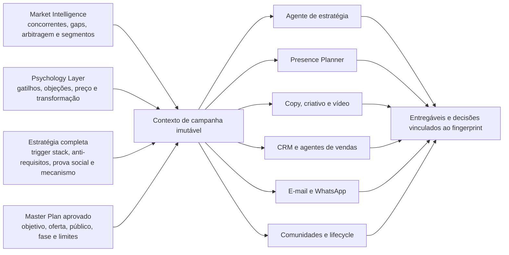
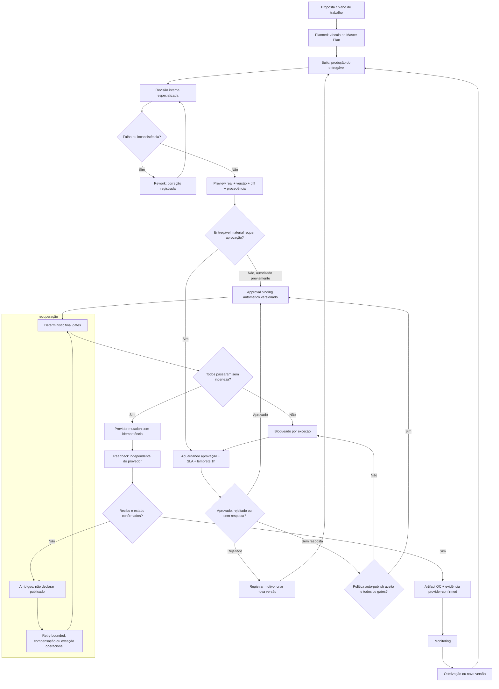
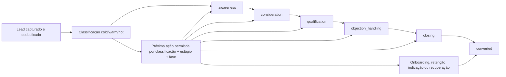
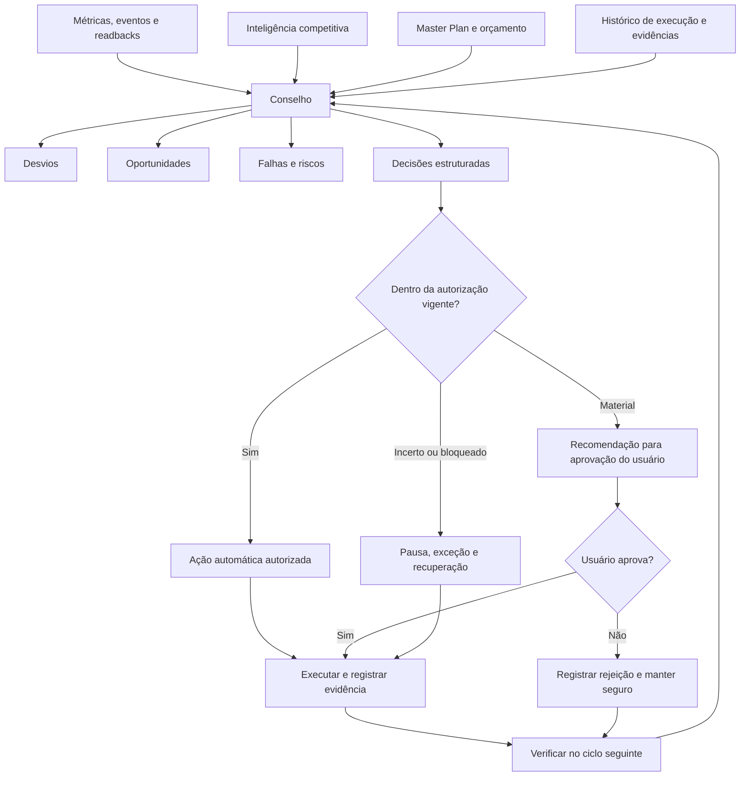
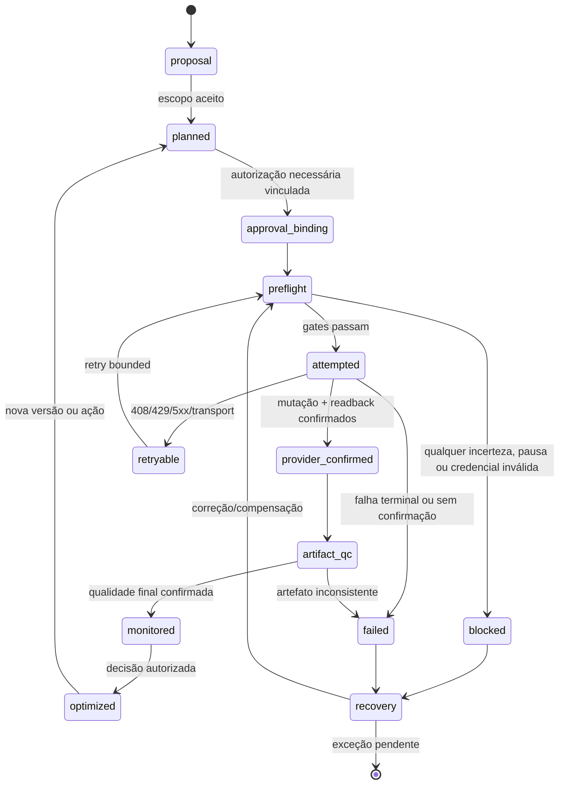

# NexOSAI — Fluxo Operacional e de Implementação Canônico

**Asaas sandbox real — 08/10/2026:** Campanhas e Academy concluíram checkout
público, pagamento com cartão fictício, webhook real, repetição sem duplicação e
estorno integral. Academy liberou acesso (200) e revogou após estorno (403), com
um único job de entrega; Campanhas registrou um único evento pago e um estornado.
Corrigida compatibilidade com `refunds: null` da API real. Cobranças estornadas e
produto de homologação desativado; histórico preservado.
[Evidência](docs/ASAAS_SANDBOX_JOURNEY_RESULTS.json). E-mail efetivamente enviado
e planos/créditos da plataforma ainda não homologados; maturidade geral inalterada.
Próximo checkpoint: webhook de planos/créditos e entrega real Academy, seguido da
conexão Meta/MAPA. Produção não foi utilizada.

**Webhooks Asaas separados — 08/10/2026:** tokens informados para Campanhas
e Academy configurados somente no perfil privado de homologação. Overrides
`ASAAS_PRODUCT_WEBHOOK_TOKEN` e `ASAAS_ACADEMY_WEBHOOK_TOKEN` isolam os endpoints;
valor ausente mantém compatibilidade, valor explicitamente vazio bloqueia acesso.
HTTP público: token próprio 200; token cruzado/ausente 401. Eventos de verificação
ignorados, sem cobrança ou concessão. [Evidência](docs/ASAAS_WEBHOOK_CONFIGURATION.json).
Próximo checkpoint: salvar as configurações no Asaas sandbox e verificar entrega
real e liquidação ponta a ponta. Maturidade geral inalterada.

**Administração global por UUID — 08/10/2026:** Command Center e privilégios
administrativos relacionados usam `PLATFORM_ADMIN_USER_IDS`, sem autorização por
e-mail. Ações administrativas exigem sessão ativa vinculada ao usuário e workspace;
frontend consulta a permissão do servidor. Founder habilitado no perfil privado de
homologação. Regressões Docker e domínio público validados; produção não ativada.
[Evidência](docs/PLATFORM_ADMIN_UUID_VALIDATION.json) e
[configuração](docs/PLATFORM_ADMIN_UUID.md). Maturidade geral inalterada.
Próximo checkpoint: desbloquear o aplicativo Meta e concluir a jornada Asaas sandbox.

**Meta — homologação de 08/10/2026:** credenciais existentes copiadas somente
para o perfil privado e runtime reiniciado. API pública confirma OAuth habilitado,
gera retorno Instagram e valida/rejeita assinatura de webhook com evento vazio.
[Evidência](docs/META_HOMOLOGATION_CONFIGURATION.json). Nenhuma conexão/publicação
real; maturidade inalterada. Próximo checkpoint: cadastrar retorno no painel Meta,
autorizar a conta e verificar recebimento real do comentário MAPA.

**Asaas sandbox — 07/10/2026:** chave de homologação autenticada com HTTP 200,
perfil privado configurado em sandbox e runtime reiniciado. Produção permanece
separada; nenhuma criação de cliente/cobrança/webhook nesta validação.
[Evidência](docs/ASAAS_SANDBOX_AUTHENTICATION.json). Maturidade inalterada;
próximo checkpoint: jornada sandbox de checkout, liquidação e webhook público.

**APIs de IA — homologação de 07/10/2026:** autenticação/listagem de modelos
OpenAI e Gemini passou; chaves nativas guardadas somente no perfil privado e
runtime reiniciado. Anthropic exige ID de workspace, ainda não informado.
[Evidência sem segredos](docs/AI_PROVIDER_HOMOLOGATION_RESULTS.json).
Nenhuma geração/inferência real certificada; maturidade inalterada. Próximo
checkpoint: resolver escopo Anthropic e validar a jornada de IA na homologação.

**Login de homologação — 07/10/2026:** Sonner montado e erro persistente no
formulário; launcher autoriza os dois endereços loopback da interface.
TypeScript/UI negativa e bloqueio de origem externa verificados; API reiniciada
e pronta. [Evidência](docs/LOGIN_HOMOLOGATION_VALIDATION.md). Maturidade inalterada;
`https://agencianexos.vip` configurado: prontidão/login/administração por UUID
passaram pelo domínio público; sessão de verificação encerrada. Próximo checkpoint:
retornos/permissões Meta e recebimento real do comentário MAPA.

**Comentário MAPA — 07/10/2026:** corrigida leitura de `id/text/media.id` no
webhook Instagram. Testes Linux/Docker passaram para resposta imediata configurada,
envio público/privado simulado e repetição/conta desconhecida. Supabase preservado.
[Evidência e limites](docs/MAPA_COMMENT_VALIDATION.md). Maturidade inalterada;
próximo checkpoint: recebimento real em conta Meta autorizada na homologação.

**CI P3 — correção de 07/10/2026:** reproduzida em Linux a ausência de TypeScript
no runner; workflow instala dependências antes do P3. Diagnóstico passa a incluir
stdout/stderr com segredos de fixtures ocultos. Três testes do runner passaram em
Linux; execução remota do novo commit permanece pendente. Supabase não foi acessado.
[Evidência e limite](docs/CI_REGRESSION_FIXES.md). Maturidade inalterada.

**Dados padrão Supabase — 07/10/2026:** esquema e privilégios verificados;
planos Solo/Agency carregados, founder preservado e duas pastas padrão criadas
no seu workspace. Nenhuma fixture ou memória compartilhada entre projetos foi
inserida. [Carga verificada](docs/SUPABASE_HOMOLOGATION_DEFAULT_DATA.json).
Próximo checkpoint: jornada de navegador e provedores sandbox na homologação.
Maturidade inalterada; desenvolvimento/regressões permanecem locais/Docker.

**Separação de ambientes — 07/10/2026:** Supabase reservado à homologação;
desenvolvimento no PostgreSQL local/Docker e regressões em bancos descartáveis
locais/Docker. Removido `homologation:test`; o runtime de testes bloqueia conexões
Supabase. Perfil de homologação separado, dados e evidências históricos preservados.
Próximo checkpoint: jornada de navegador e provedores sandbox na homologação.
[Política e comandos](docs/SUPABASE_HOMOLOGATION.md). Maturidade inalterada.

**Supabase — homologação de 06/10/2026:** esquema externo preparado (177 tabelas,
75 entradas de esquema/migração e 19 triggers ativos), TLS verificado, role privada
e acesso público bloqueado. Seis grupos de regressão, administração founder por
UUID e API compilada com Redis exclusivo passaram. Perfis, portas e filas locais
permanecem separados. Próximo checkpoint: jornada de navegador e provedores
sandbox autorizados. [Guia/evidência](docs/SUPABASE_HOMOLOGATION.md).
Maturidade permanece inalterada; implantação pública não foi feita.

> **Fonte única de verdade cumulativa.** Este arquivo incorpora os mapas e descrições anteriores de workflow em um único sistema.
> Ele define o comportamento operacional desejado do NexOSAI, os limites de responsabilidade humana, os gates de segurança e a ordem de implementação.
> Nenhuma área deve ser apresentada como autônoma antes de cumprir os gates e a Definition of Done desta especificação.
> Nenhum fluxo anterior deixa de existir por não aparecer resumido no diagrama mestre: ele deve ser preservado, conectado ao Realization Engine e fortalecido pelos novos gates, salvo quando houver uma descontinuação explícita e aprovada.

## 1. Doutrina operacional não negociável

**Ativação real P0 — checkpoint de 06/10/2026:** por autorização explícita,
`founder@nexos.ai` foi criado como primeiro usuário master local. UUID Academy,
login, sessão, revogação e auditoria passaram por HTTP; segredo legado desativado.
A credencial disponível retornou 401 no Asaas sandbox; o token local foi preparado, mas faltam chave válida
e URL pública da aplicação para o webhook. Não houve cobrança ou implantação
externa. M10/M11/M12 permanecem no estado anterior.
[Evidência e requisitos](./docs/P0_REAL_ACTIVATION_STATUS.md).

**Isolamento de projetos e usuários (06/10/2026):** ownership atual verificado
por requisição; memória e contexto vinculados a workspace/projeto; referências
entre projetos removidas; configurações concorrentes de agentes isoladas;
histórico privado do navegador separado e limpo na troca de conta/workspace.
Migração 0069, testes negativos e 23 grupos locais passaram em imagem reconstruída.
[Evidência e limites](./docs/PROJECT_CONTEXT_ISOLATION.md). CI remoto, aplicação
da migração em homologação e auditoria dos artefatos antigos permanecem pendentes.
M10 continua concluído; M11/M12 permanecem incompletos.

**Reparo de CI (06/10/2026):** builder de saúde isolado das dependências de
infraestrutura e chave descartável de criptografia gerada com 32 bytes.
Saúde sem banco/Redis e retomada de conteúdo passaram localmente; aguarda-se
reexecução dos jobs remotos. [Evidência](./docs/CI_REGRESSION_FIXES.md).

**Checkpoint P3 local (06/10/2026):** jornada com provedores simulados, outbox
Academy, concessões de objetos vinculadas ao lease e regressões dos contratos
de mídia/execução foram validados em containers próprios. A migração 0068
restaura triggers de integridade omitidos pelo bootstrap histórico. Dataset de
IA versionado e revisão vinculada ao artefato são preparação para avaliação
real, sem promover consentimento, qualidade de modelos ou maturidade M11/M12.
Evidência, limites e próximo checkpoint externo:
[P3_CLOSEOUT](./docs/P3_CLOSEOUT.md) e [checklist](./NEXOS_BUILD_CHECKLIST.md).

**Implantação anterior ao P3 (06/10/2026):** imagens Docker e seleção entre
PostgreSQL local/externo com TLS foram validadas em infraestrutura isolada.
[Guia e limites](./docs/DOCKER_DEPLOYMENT.md). Esse checkpoint não certifica
jornada, consentimento ou qualidade de IA; homologação real permanece.

**Evidência de infraestrutura (06/10/2026):** P1/P2 preparados e validados
localmente, conforme [P1_CLOSEOUT](./docs/P1_CLOSEOUT.md),
[P2_CLOSEOUT](./docs/P2_CLOSEOUT.md) e
[checklist canônico](./NEXOS_BUILD_CHECKLIST.md). Recuperação, persistência e carga
de fixtures sustentam os gates de resiliência; homologação externa, consentimento,
jornada e qualidade da IA continuam exigindo suas próprias evidências.

O NexOSAI não é uma coleção de ferramentas que o cliente precisa operar. É uma **agência autônoma de marketing digital**, monitorada pelo cliente.

O usuário fornece o briefing e decide somente o que é material ou financeiramente relevante:

- aprovar o orçamento e seus limites;
- aprovar versões do Master Plan;
- aprovar ou rejeitar entregáveis materiais;
- aprovar mudanças financeiras materiais entre plataformas;
- intervir em exceções críticas, riscos ou bloqueios que não possam ser resolvidos com segurança.

Dentro da autorização vigente, o NexOS:

- pesquisa mercado, concorrentes, audiência e contexto;
- constrói estratégia, oferta, posicionamento e plano;
- cria e conecta website, páginas, funil, checkout, CRM e comunicações;
- produz conteúdo, criativos, vídeos, anúncios, sequências e materiais comerciais;
- configura integrações, tracking, eventos, UTMs e webhooks;
- publica somente após os gates determinísticos;
- lê de volta o estado do provedor e registra recibos;
- captura, classifica, atende e conduz leads;
- executa onboarding, retenção, reativação, indicação e comunidades autorizadas;
- monitora resultados, convoca o Conselho, corrige falhas e otimiza continuamente.

O sistema **não pode**:

- transformar uma recomendação em aprovação do usuário;
- gastar, mover orçamento entre plataformas ou alterar estratégia material sem autorização;
- declarar automática uma ação que depende de operador humano ou de uma API indisponível;
- publicar diante de rejeição explícita, incerteza crítica, credencial inválida, pausa ativa, Master Plan obsoleto ou falha de verificação;
- usar fallback genérico, conteúdo de outra fase, contexto de outro workspace ou dados inventados;
- expor raciocínio interno sensível dos modelos como se fosse evidência operacional.

### Responsabilidade humana versus sistema

| Decisão | Usuário | NexOS |
|---|---:|---:|
| Briefing, objetivo e restrições | fornece | interpreta e valida |
| Orçamento e limites | aprova | executa dentro do envelope |
| Master Plan | aprova versão | pesquisa, propõe, versiona e vincula |
| Entregável material | aprova/rejeita | produz, revisa, refaz e publica |
| Operação diária dentro do plano | acompanha | executa integralmente |
| Otimização dentro de uma plataforma e orçamento aprovados | acompanha | decide e executa |
| Mudança material de estratégia ou orçamento entre plataformas | aprova | recomenda com métricas |
| Exceção crítica | intervém quando necessário | detecta, pausa, explica e prepara opções |

### 1.1 Fluxos anteriores preservados e incorporados

O Realization Engine e o Control Room não substituem o pipeline anterior. Eles ampliam e conectam suas capacidades:

| Fluxo anterior | Continua existindo | Integração no sistema canônico |
|---|---:|---|
| Intake → estratégia → conteúdo → aprovação → lançamento → conclusão | Sim | É a espinha dorsal de campanha e alimenta o Master Plan, a realização e o lifecycle |
| Aprovação e geração de criativos | Sim | Torna-se o lifecycle de entregáveis com revisão, preview, versão, diff, QC e evidência |
| Sequências de lançamento e scheduler | Sim | Integram e-mail, WhatsApp, CRM, jornada do lead, agenda e execução idempotente |
| Publicação social e autopost | Sim | Integram Content/Social com gates finais, credenciais, readback, recibos e métricas |
| Respostas automáticas de WhatsApp | Sim | Integram CRM/Sales; evoluem para agentes conversacionais vinculados a estágio e Master Plan |
| Relatórios semanais | Sim | Integram Reports, Control Room, Conselho e ciclos de otimização |
| Schedulers e timers operacionais | Sim | Permanecem como infraestrutura, com ownership único, idempotência, bounded retry e evidência |
| Captura, classificação e roteamento de leads | Sim | Alimentam progressão adjacente, vendas, onboarding, retenção, indicação e recuperação |

Toda implementação nova deve indicar qual fluxo anterior está preservando ou ampliando. Se uma mudança apagar uma capacidade anterior sem substituição funcional comprovada, ela é uma regressão.

## 2. Fluxo mestre: do briefing à otimização perpétua

O caminho feliz nunca elimina os caminhos de falha: qualquer incerteza abre exceção, preserva o último estado confirmado e retorna para diagnóstico, aprovação ou recuperação. Dependências externas bloqueiam apenas a frente afetada; as demais continuam em paralelo.

## 3. Workforce Realization Engine

Depois da aprovação do Master Plan, o Workforce transforma estratégia em uma operação comercial conectada. Cada workstream recebe o mesmo contexto imutável: objetivo final, oferta, posicionamento, público, fase, restrições, orçamento, psicologia, inteligência de mercado, versão e fingerprint do Master Plan.

### Workstreams paralelos

1. **Website e infraestrutura digital**
   - arquitetura, identidade, copy, páginas, responsividade, domínio, DNS, formulários, tracking, publicação e testes de conversão;
   - resultado: ambiente publicado, navegável, mensurável e verificável.
2. **Oferta, funil e checkout**
   - mecanismo, promessa, storytelling, landing page, captura, checkout, order bump, upsell, downsell, obrigado, onboarding, retenção, reativação e indicação;
   - resultado: jornada conectada e vinculada à versão aprovada.
3. **Criativos, conteúdo, social e vídeo**
   - copies, CTAs, anúncios, posts, carrosséis, stories, reels, vídeos, roteiros, capas, legendas e materiais de vendas;
   - resultado: entregáveis versionados, revisados e com preview adequado ao canal.
4. **CRM, vendas e atendimento**
   - captura, deduplicação, classificação, estágio, qualificação, objeções, follow-up, conversão e handoff;
   - resultado: cada lead tem próxima ação permitida e auditável.
5. **E-mail e WhatsApp**
   - sequências, PLCs, mensagens transacionais e conversacionais, respeitando classificação, estágio, consentimento, opt-out e provedor;
   - resultado: comunicação contextual, nunca genérica ou de fase incorreta.
6. **Comunidades e coortes**
   - elegibilidade, grupos, capacidade, coortes, conteúdo, moderação e encaminhamento de casos sensíveis;
   - APIs ausentes produzem operação assistida declarada, nunca falsa automação.
7. **Tracking, dados e integrações**
   - pixels, UTMs, eventos, formulários, webhooks, CRM, checkout, analytics, anúncios, reconciliação e saúde de credenciais;
   - resultado: configuração criada, conectada, publicada, lida de volta e confirmada.
8. **Onboarding, retenção e lifecycle**
   - boas-vindas, ativação, sucesso inicial, risco de churn, recuperação, reativação, indicação, expansão e encerramento;
   - resultado: o trabalho continua depois da venda.

Cada workstream pode ter trabalho bloqueado por uma dependência externa sem interromper os demais. O preflight só libera ativação quando as dependências obrigatórias daquele lançamento estiverem confirmadas.

## 4. Inteligência de campanha chegando a todos os agentes

Posts, reels e qualquer outro entregável não podem ser produzidos a partir de pilares genéricos. O contexto é montado por campanha e workspace, com vínculo ao Master Plan aprovado.

O bloco de inteligência deve conter, quando disponíveis:

- três vulnerabilidades relevantes de concorrentes;
- gap principal de posicionamento;
- arbitragem de plataforma e de formato;
- segmentos inexplorados;
- gatilhos, objeções, hooks de preço, anti-requisitos e bridge de transformação;
- sequência de gatilhos, blueprint de prova social, mecanismo diferenciador e proposta única;
- objetivo, oferta, fase e restrições da campanha.

Regras obrigatórias:

- nenhum fallback para conteúdo genérico ou de outra fase;
- nenhuma leitura de contexto de outro workspace;
- ausência de dado estratégico deve ser explícita e bloquear o uso daquele argumento, não inventá-lo;
- toda saída preserva `campaignId`, `workspaceId`, `masterplanVersionId` e `contextFingerprint`;
- o agente pode sintetizar contexto, mas não alterar a autoridade do Master Plan.

## 5. Ciclo de vida de cada entregável

### Preview obrigatório

Todo entregável visual precisa de preview antes de publicação: website, landing page, checkout, criativo, anúncio, post, carrossel, story, reel, vídeo, e-mail visual, apresentação e onboarding. O preview mostra, quando aplicável, desktop/mobile, canal, texto, CTA, mídia, data, público, fase, versão do Master Plan, histórico, diff, revisões e análise final. Vídeos incluem player, capa, duração, roteiro, legendas, áudio, CTA, formato e canal.

### Ausência de resposta versus rejeição

- Ausência de resposta só permite publicação se houver política versionada de auto-publicação aceita e todos os gates passarem.
- Rejeição explícita nunca é aprovação implícita.
- Depois da rejeição: motivo → nova versão → nova revisão → novo preview → nova decisão ou prazo.
- Uma hora antes do prazo, o sistema notifica no workspace e, quando configurado/autorizado, por e-mail e WhatsApp.
- O sistema registra tentativa, entrega, versão, prazo, decisão, validações, publicação e recibo.

Os gates finais incluem Master Plan atual, fase, orçamento, direitos, compliance, marca, provedor, credencial, agenda, pausa, risco, preview imutável e ausência de mudança material. Qualquer incerteza falha fechada.

## 6. Lifecycle de leads e vendas

Classificação e estágio são dimensões independentes:

- classificação: `cold`, `warm`, `hot`;
- estágio: `awareness` → `consideration` → `qualification` → `objection_handling` → `closing` → `converted`.

Regras estruturais:

- só avança uma fase por vez;
- cada avanço exige evidência identificável, contato e workspace corretos, atualização transacional e proteção contra concorrência;
- não há salto, regressão silenciosa ou reenvio após timeout ambíguo;
- `cold` recebe descoberta/captura/PLC1;
- `warm` recebe nutrição e consideração, como PLC1–PLC3;
- `warm` não recebe `cart_open`, `cart_middle` ou `cart_close`;
- `hot` não recebe fechamento automaticamente sem estágio `closing`;
- `cart_close` exige `hot` + `closing`;
- convertidos e descadastrados não recebem primeiro contato;
- e-mail e WhatsApp seguem a mesma política;
- não existe fallback hot ou genérico quando falta a variante correta.

Agentes conversacionais especializados são um workstream futuro: devem usar histórico, classificação, estágio e Master Plan; responder dúvidas, qualificar, tratar objeções e escolher somente a próxima ação permitida. Nunca inventam preço, bônus ou garantia.

## 7. Conselho operacional diário

Uma reunião do Conselho é uma ata operacional, não uma transcrição: contexto, métricas, evidências, problemas, hipóteses, especialistas, decisões, ações, aprovações e resultado posterior. O Conselho recomenda, bloqueia ou autoriza dentro do envelope; **nunca aprova pelo usuário**.

## 8. Workspace e Control Room

O workspace é uma central de monitoramento, prestação de contas e aprovação — não um painel de ferramentas manuais.

### Arquitetura de informação

1. **Visão geral**: trabalho realizado, exceções, decisões pendentes e próximos eventos.
2. **Master Plan**: versões, aprovação, fingerprint, objetivos, limites e vínculo.
3. **Aprovações**: orçamento, Master Plan e entregáveis; preview, prazo, histórico, aprovar/rejeitar/solicitar alteração.
4. **Conselho**: reuniões, evidências, decisões, ações e resultados posteriores.
5. **Control Room da campanha**: status, workstreams, checkpoints, entregáveis, credenciais, evidências e receipts.
6. **Verticais full-stack**: Website, Funnels, Content, Social, Schedule, CRM, Sales, Ads, SEO, Communities e Lifecycle, apenas quando operacionais.
7. **Budget, Reports e Integrations**: limites, relatórios auditáveis, exportações e situação operacional.

Cada contador ou atividade deve ser clicável e levar ao registro exato: campanha, versão, agente, revisão, motivo, ação externa, recibo, resultado e evidência. Não existem contadores de vaidade.

Cada vertical operacional deve exibir:

- visão geral;
- trabalho em andamento;
- entregáveis e previews;
- atividade dos agentes;
- revisões e retrabalho;
- agenda;
- métricas;
- decisões;
- relatórios/downloads;
- integrações e saúde operacional.

Uma área só entra na navegação quando possui execução real, dados de origem, fila, preview, aprovação, evidência, métricas e drilldowns. Capacidades futuras permanecem fora do menu.

## 9. Máquina universal de execução e evidência

Estados devem ser append-only quando representam fatos. Nenhuma camada pode declarar publicação sem recibo/readback verificável. Falhas ambíguas não são sucesso; retries são idempotentes e limitados; credenciais inválidas falham antes do adapter; cache confirmado não é sobrescrito por erro.

## 10. Ondas de implementação

### Fundamentos — concluídos

- **DONE** — evidência de execução, ownership e isolamento por workspace;
- **DONE** — gate canônico de credencial social, incluindo presença e métricas;
- **DONE** — separação entre aprovação e execução/publicação;
- **DONE** — salvaguardas de scheduler e integridade de conteúdo;
- **DONE** — Master Plan versionado, aprovação, fingerprint e binding;
- **DONE** — API read-only do Control Room, com sanitização e estados vazios;
- **DONE** — posts/reels alimentados por market intel, estratégia e psychology layer;
- **DONE** — fundação de captura/roteamento determinístico de leads;
- **DONE** — migrações de banco determinísticas, append-only e sem prompts interativos.

### Próxima entrega

- **DONE** — Control Room UI com contadores clicáveis, composição persistida, status de credenciais e estados canônicos de evidência.
- **DONE** — drilldown de evidência: timeline paginada, filtros exatos, links de origem, sanitização e ownership por workspace/campanha.
- **DONE** — preview universal read-only: sete fontes persistidas, paginação determinística, filtros, estados honestos e renderização segura desktop/mobile.
- **DONE** — version diff para Master Plan e revisões persistidas, sem inventar histórico para fontes mutáveis.
- **DONE** — Approval Center com decisões append-only, binding exato e motivos governados.
- **DONE** — SLA e lembretes in-app com aviso de uma hora, receipts, auditoria, escalonamento e expiração fail-closed.
- **NEXT** — autoexecução condicionada por política versionada, autorização vigente e gates finais.

### Depois do Control Room

1. Contratos do Realization Engine: proposal, binding, preflight, attempt, receipt, QC, compensation.
2. Preview/versionamento/diffs para entregáveis visuais e de vídeo.
3. Central de aprovações, SLA, lembrete de uma hora e auto-publish condicionado.
4. Conselho operacional com ata, decisões, ações e resultados do ciclo seguinte.
5. Verticais full-stack, nesta ordem: Content/Social, Website/Funnels, vídeo/creative, e-mail/Community, CRM/Sales, Ads, SEO, Lifecycle e Analytics.
6. Agentes conversacionais especializados para vendas por e-mail e WhatsApp.
7. Lifecycle, coortes, comunidades, retenção, reativação e indicação.
8. Otimização contínua, relatórios, exports, moeda/localização e homologação de produção.

Não se deve declarar automação de um provedor ou domínio enquanto o adapter, permissão, readback, evidência e recuperação correspondentes não existirem.

## 11. Definition of Done

### Para cada vertical

Uma vertical só é considerada pronta quando possui:

- contrato de dados e workspace ownership;
- agente/workers que executam trabalho real;
- fila ou scheduler idempotente;
- preflight e gates de aprovação/autorização;
- preview aplicável;
- revisão interna e histórico de versões;
- integração/provider adapter com credencial fail-closed;
- mutação, readback e recibo;
- evidência append-only e timeline;
- retry/compensação/exceção;
- métricas de origem e reconciliação;
- Control Room com contadores clicáveis e drilldowns;
- relatórios/exportações;
- testes unitários, integração, concorrência, ownership e falha;
- navegação progressiva somente após tudo acima.

### Aceitação global da agência autônoma

O NexOS só cumpre a promessa quando consegue demonstrar, com registros:

- briefing → Master Plan aprovado → realização paralela;
- ativos conectados e preflight verificável;
- preview e diff antes de entregável visual;
- aprovação material e orçamento respeitados;
- publicação somente com provider receipt/readback;
- lead sem salto de classificação/estágio;
- atendimento contextual em e-mail e WhatsApp;
- onboarding, retenção, comunidade e reativação operando;
- Conselho usando evidências reais;
- ações automáticas dentro do envelope;
- bloqueio seguro para rejeição, pausa, risco, incerteza e credencial inválida;
- recuperação sem falso sucesso ou duplicação;
- histórico completo de agentes, versões, revisões, decisões, ações e resultados;
- nenhuma mistura de workspaces, campanhas, fases ou contextos;
- cliente limitado a briefing, aprovações materiais e exceções relevantes.

## 12. Fila compacta de implementação — 12 níveis de maturidade

Esta fila não é um segundo fluxo comercial. Ela é o eixo de maturidade aplicado a cada capacidade dos 12 estágios operacionais definidos no `NEXOS_CAPABILITY_INDEX.md`.

1. **Control Room UI**: consumir a API existente com estado vazio honesto.
2. **Contadores clicáveis**: aprovações, entregáveis, bloqueios, falhas e confirmações.
3. **Drilldown de evidência**: timeline de agentes, versões, receipts, readbacks e resultados.
4. **Preview universal**: contrato de preview para texto, imagem, vídeo, páginas e e-mail.
5. **Version diff**: comparação de conteúdo, Master Plan, fase, CTA, mídia e revisões.
6. **Approval Center**: orçamento, Master Plan e entregáveis com rejeição motivada.
7. **SLA e lembrete**: dueAt, aviso de uma hora, canais, entrega e decisão.
8. **Autoexecução condicionada**: política versionada, final gates, idempotência e pausa segura.
9. **Realization contracts**: workstreams, preflight, receipts, QC e compensation.
10. **Council operacional**: reunião baseada em evidências, decisão, ação e verificação.
11. **Primeira vertical full-stack**: Content/Social com calendário, previews, métricas, inbox e relatórios.
12. **Agentes de vendas e lifecycle**: conversação contextual, onboarding, retenção, comunidade e otimização.

Este fluxo é adotado como contrato de implementação. Cada alteração futura deve indicar qual gate, estado, vertical e evidência ela acrescenta — ou ser rejeitada por duplicar, enfraquecer ou ocultar este fluxo.

### Checkpoint comprovado

- **M01–M08 concluídos:** Control Room, contadores, drilldown de evidência, preview universal, version diff, Approval Center, SLA/lembretes e autoexecução condicionada permanecem cumulativos.
- **M05 Version diff:** compara somente snapshots imutáveis do Master Plan e revisões persistidas de páginas; base e alvo são explícitos, o resultado é read-only, tenant-scoped, determinístico, sanitizado e limitado.
- Fontes mutáveis sem histórico persistido continuam visíveis como `history_not_persisted`; timestamps nunca são promovidos a versões.
- Comparações incompletas por limite de profundidade, nós, itens, mudanças ou bytes nunca são apresentadas como idênticas e carregam aviso explícito.
- **M06 Approval Center:** decisões de Master Plan, conteúdo e checkpoints são append-only, tenant-scoped, vinculadas ao snapshot/contexto exatos e protegidas contra stale, corrida e replay conflitante; rejeição e revisão exigem motivo.
- Aprovar registra somente a decisão: não publica, executa, gera, chama provider nem cobra créditos.
- Page, social, creative e video permanecem visíveis como adapters ainda não governados, sem inventar autorização.
- **M07 SLA e lembretes:** obrigações exatas por snapshot possuem aviso in-app uma hora antes, due, escalonamento e expiração; eventos e audits são append-only e exatamente uma vez por tipo; decisão e scheduler compartilham locks e expiração nunca aprova.
- Canais externos permanecem não suportados até possuírem autorização e receipts; M07 não publica, executa, gera, chama provider nem cobra.
- **M08 Autoexecução condicionada:** somente `paid_media_pause`, sob policy versionada/owner-authorized/temporária e binding exato; approval não executa, preflight falha fechado, apply é idempotente e o resultado só confirma após receipt+readback correspondente.
- Execução, criação e revogação compartilham locks PostgreSQL cross-process; restart reconcilia por readback sem repetir a mutação e qualquer ambiguidade exige recuperação.
- **M09 concluído:** contratos reutilizáveis governam `paid_media_pause` e `paid_media_launch` com binding, preflight, attempt, receipt+readback, QC, monitoramento, retry, recovery e compensation honesta.
- **M10 concluído:** ciclos, atas, decisões e outcomes persistidos e append-only; a decisão congela meta, baseline, limiar, janela, responsável e prazo. A ação referencia exclusivamente um contrato M09 da mesma campanha e versão/contexto/snapshot exatos, sem autorizar nem chamar provider. A verificação pertence a um ciclo posterior da mesma vinculação cuja ata cita o contrato, e exige attempt confirmado com receipt, readback, QC aprovado e monitor; resultado inconclusivo permanece histórico e pode ser reverificado com evidência nova.
- **Próximo checkpoint único:** M11 Content/Social full-stack, com execução real e evidência própria antes de ampliar as famílias governadas.

## 13. Capability Index canônico

O plano completo de indexação está em [`NEXOS_CAPABILITY_INDEX.md`](./NEXOS_CAPABILITY_INDEX.md).
O checkpoint atualizado de construção está em [`NEXOS_BUILD_CHECKLIST.md`](./NEXOS_BUILD_CHECKLIST.md).

Ele unifica:

- os 12 estágios operacionais, da fundação à homologação;
- os 12 níveis de maturidade, do Control Room ao lifecycle autônomo;
- o Realization Engine;
- o Control Room;
- o lifecycle de leads e clientes;
- conteúdo, social, mídia paga, vendas, pagamento, entrega, retenção e comunidade;
- governança, recuperação e produção comprovada.

Toda capability deve possuir ID, estágio, estado, nível de maturidade, ownership, dependências, interfaces, executores, adapters, autorização, evidências, métricas, testes, recovery e limitações.
